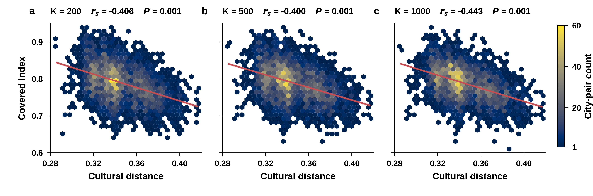

# PCL urban morphology data and cultural validation

This repository contains the PCL prototype features used for the study of urban morphological similarity, together with an external validation against WVS/EVS cultural distance.

## Repository layout

The files are physically separated by content type:

- [`code/`](code/): Python analysis and plotting code.
- [`images/`](images/): publication figures in PNG, PDF, and TIFF formats.
- [`data/`](data/): raw, external, feature, raster, and derived result data.
- [`docs/`](docs/): experiment documentation and manuscript text outputs.
- `cache/`: ignored Python and thumbnail caches.

See [`FILE_CLASSIFICATION.md`](FILE_CLASSIFICATION.md) for the detailed Chinese
classification index.

## Data

The original archive is stored at `data/raw/PCL.tar.gz` (18.9 MB). The extracted
cluster and merged rasters are stored under `data/rasters/`.

```bash
tar -xzf data/raw/PCL.tar.gz --strip-components=1 -C /path/to/empty/temp
```

It contains three prototype resolutions (`K=200, 500, 1000`), city label rasters, representative image patches, and 128-dimensional prototype features for 130 cities.

## Cultural validation

See [`docs/cultural_validation/README.md`](docs/cultural_validation/README.md) for data sources, methodology, reproduction instructions, and interpretation limits. The main result is stable across all three prototype resolutions: larger independently measured WVS/EVS cultural distance is associated with lower satellite-derived Covered Index.



External source files are not redistributed in this repository. Download them from their original providers as documented before rerunning the script. Derived analysis tables and results are included under `data/results/cultural_validation/`.

## Historical connection validation

Aggregate results and code for the shared historical-regime layer are documented in [`docs/shared_regime_validation/`](docs/shared_regime_validation/README.md). Raw historical workbooks are not redistributed.

Aggregate results, reproducible code, and a publication figure for the combined direct-tie layer are documented in [`docs/direct_tie_layer_validation/`](docs/direct_tie_layer_validation/README.md). The raw historical workbook and pair-level reconstruction files are not redistributed.

The geographic-distance baseline, including Spearman correlations and single-predictor QAP regression across all city pairs, is documented in [`docs/geographic_baseline_validation/`](docs/geographic_baseline_validation/README.md).
