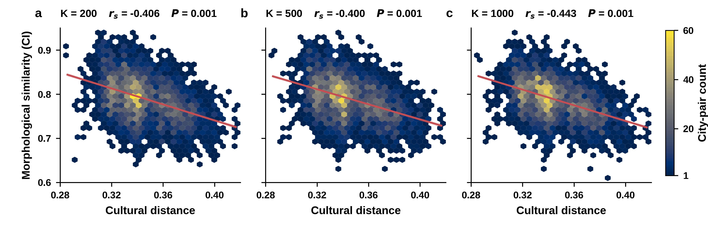

# PCL urban morphology data and cultural validation

This repository contains the PCL prototype features used for the study of urban morphological similarity, together with an external validation against WVS/EVS cultural distance.

## Data

The original archive is stored at `data/PCL.tar.gz` (18.9 MB). Extract it at the repository root before rerunning the validation:

```bash
tar -xzf data/PCL.tar.gz --strip-components=1
```

It contains three prototype resolutions (`K=200, 500, 1000`), city label rasters, representative image patches, and 128-dimensional prototype features for 130 cities.

## Cultural validation

See [`cultural_validation/README.md`](cultural_validation/README.md) for data sources, methodology, reproduction instructions, and interpretation limits. The main result is stable across all three prototype resolutions: larger independently measured WVS/EVS cultural distance is associated with lower satellite-derived Covered Index.



External source files are not redistributed in this repository. Download them from their original providers as documented before rerunning the script. Derived analysis tables and results are included under `cultural_validation/output/`.

Additional cross-validation against Hofstede dimensions, EcoCultural psychological domains, and CEPII language relations is documented in [`cultural_validation/output/ADDITIONAL_VALIDATION.md`](cultural_validation/output/ADDITIONAL_VALIDATION.md). The analysis script is [`run_additional_cross_validation.py`](cultural_validation/scripts/run_additional_cross_validation.py).

Nature-style three-panel figures for each external cultural criterion are generated by [`plot_additional_nature_style.py`](cultural_validation/scripts/plot_additional_nature_style.py) and stored under `cultural_validation/output/additional_*_nature.*`.
