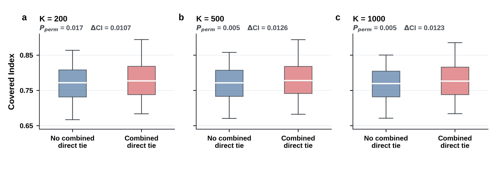

# Combined direct ties versus morphological similarity

This validation compares the workbook's binary **Direct Tie Matrix** with the symmetric Covered Index (CI) at `K = 200, 500, 1000`.

The matrix is a combined layer defined in the source workbook as the logical union of verified D1–D10 historical ties, shared official language, and the additional direct-tie input. It therefore should not be interpreted as archival direct evidence alone.

## Method

- Match the historical city list to the 130 cities with CI estimates.
- Exclude diagonal elements and retain one observation per unordered city pair.
- Define symmetric CI as the mean of `CI(A→B)` and `CI(B→A)`.
- Compare pairs with and without a combined direct tie for all pairs and, as a geographic sensitivity check, for cross-country pairs only.
- Calculate Pearson and Spearman correlations, mean CI differences, Cohen's d, and ROC AUC.
- Evaluate positive Pearson associations with 9,999 city-label permutations. This preserves the dependence structure of the city-pair network.

## Results

Across all 8,385 city pairs, a combined direct tie is associated with slightly higher CI. The one-sided city-label permutation results are:

| K | Pearson r | Permutation P | Mean CI difference |
|---:|---:|---:|---:|
| 200 | 0.0736 | 0.0166 | 0.0107 |
| 500 | 0.0894 | 0.0050 | 0.0126 |
| 1000 | 0.0909 | 0.0055 | 0.0123 |

After restricting to cross-country pairs, the association is near zero and not significant (`P = 0.4662, 0.3247, 0.3001`). This indicates that the overall signal is largely attributable to within-country structure, consistent with the combined layer's inclusion of shared official language.



## Reproduce

Place the workbook at `data/raw/historical_city_connection_layers_138x138.xlsx`, then run:

```bash
python3 code/direct_tie_layer_validation/calculate_direct_tie_correlation.py
python3 code/direct_tie_layer_validation/plot_direct_tie.py
```

The raw workbook, pair-level city mapping, and permutation null arrays are intentionally excluded from version control. Aggregate statistics are in `data/results/direct_tie_layer_validation/`; publication figures are in `images/direct_tie_layer_validation/`.
