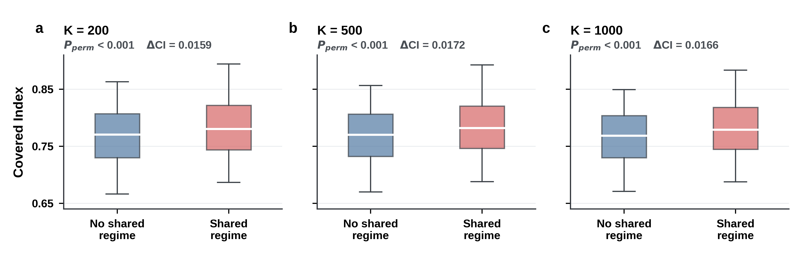

# Shared historical regime versus Covered Index

This analysis tests whether cities sharing at least one historical or imperial regime have higher symmetric Covered Index. It uses 130 matched cities, excludes the diagonal, and reports both all-city-pair and cross-country-only results. Dependence among dyads is addressed with 9,999 city-label permutations.

Main result across K=200, 500, and 1000:

- all pairs: Pearson r = 0.110–0.123, one-sided permutation P <= 0.0003;
- cross-country pairs: Pearson r = 0.051–0.061, one-sided permutation P = 0.021–0.046;
- shared-regime pairs have mean CI higher by 0.016–0.017 overall and 0.007–0.008 across countries.

Only aggregate output and analysis code are committed. Raw inputs, city-level mappings, pair-level records, and permutation arrays are intentionally excluded. To reproduce locally, place the workbook at `data/raw/historical_city_connection_layers_138x138.xlsx` and run:

```bash
python3 code/shared_regime_validation/calculate_shared_regime_correlation.py
```

Generate the Nature-style two-row figure (all pairs and cross-country-only pairs):

```bash
sudo apt install fonts-liberation2
python3 code/shared_regime_validation/plot_shared_regime.py
```

The figure is provided as an editable PDF and 600 dpi PNG/TIFF.


