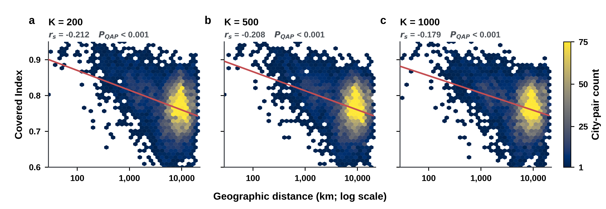

# Geographic-distance baseline of the Covered Index

This experiment tests the expected geographic baseline that more distant cities exhibit lower urban morphological similarity:

\[
CI_{ij} = \alpha + \beta \log(Distance_{ij}) + \varepsilon_{ij}.
\]

## Data and method

- Use all 130 cities and all 8,385 unordered city pairs; diagonal elements are excluded.
- Calculate great-circle distance from the city raster-centroid coordinates in `cultural_validation/output/city_country_mapping.csv`.
- Use the symmetric Covered Index, defined as the mean of `CI(i→j)` and `CI(j→i)`.
- Report Spearman correlation between CI and geographic distance.
- Estimate the single-predictor QAP regression of CI on natural-log distance. This is the single-predictor form of MRQAP.
- Assess negative associations with 9,999 simultaneous row–column city-label permutations and the standard plus-one correction. QAP preserves the topology and dyadic dependence of the CI network.

## Results

| K | Spearman rho | Spearman QAP P | Beta for log distance | Standardized beta | R-squared | Regression QAP P |
|---:|---:|---:|---:|---:|---:|---:|
| 200 | -0.2122 | 0.0001 | -0.0240 | -0.3643 | 0.1327 | 0.0001 |
| 500 | -0.2079 | 0.0001 | -0.0231 | -0.3623 | 0.1313 | 0.0001 |
| 1,000 | -0.1793 | 0.0001 | -0.0209 | -0.3401 | 0.1156 | 0.0001 |

Across all prototype resolutions, geographic distance is negatively associated with CI. The result establishes a stable geographic baseline: cities that are farther apart are, on average, less similar in their physical morphology. It does not imply that geography is the only determinant of CI; subsequent cultural and historical validations test whether meaningful affinities remain beyond this general baseline.



## Reproduce

```bash
python3 geographic_baseline_validation/scripts/calculate_geographic_baseline.py
python3 geographic_baseline_validation/scripts/plot_geographic_baseline.py
```

The scripts generate aggregate results, metadata, and publication figures in PDF, PNG, and 600 dpi TIFF formats.
