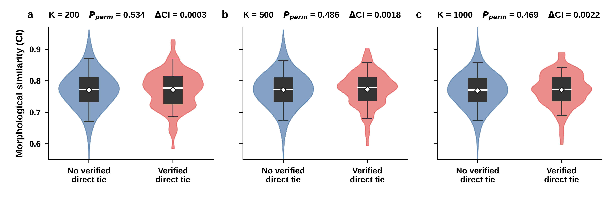

# Historical direct ties versus Covered Index

This analysis compares symmetric Covered Index (the mean of both CI directions) between city pairs with and without a verified direct historical tie. The diagonal is excluded. Inference uses 9,999 city-label permutations because city pairs are not independent.

Only publication outputs, the three-row aggregate result table, and plotting code are committed. Raw data are intentionally excluded, including:

- `historical_city_direct_ties_138x138.xlsx`
- city-level or city-pair raw records
- name-mapping tables
- permutation arrays

To reproduce the figure locally, place `historical_city_direct_ties_138x138.xlsx` at the repository root and ensure the existing derived CI table is available, then run:

```bash
sudo apt install fonts-liberation2
python3 historical_ties_validation/scripts/plot_historical_ties.py
```

Outputs are provided as an editable PDF and 600 dpi PNG/TIFF.


